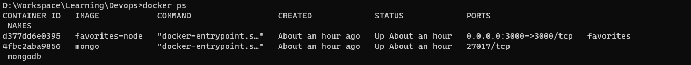
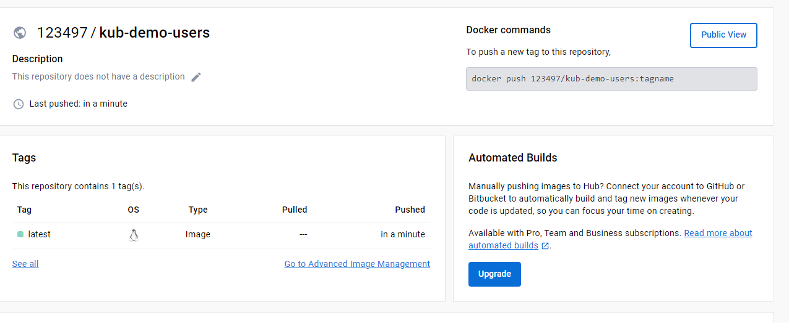
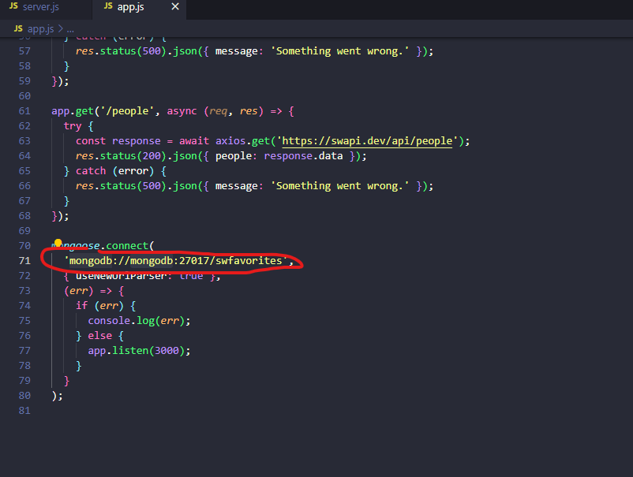
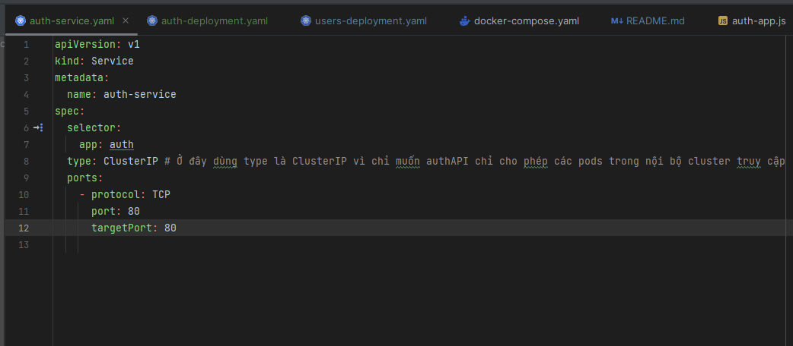
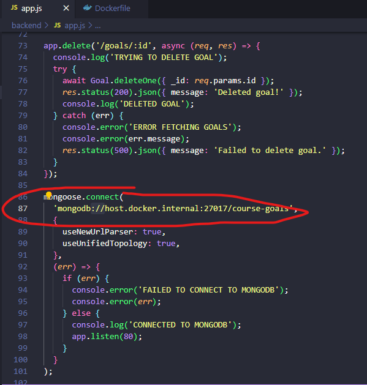
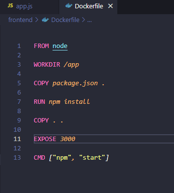
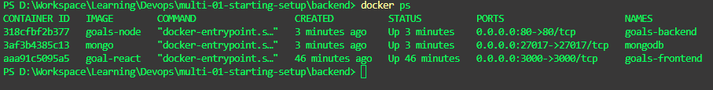

## **Phần 1: Các lệnh cơ bản**

Có 2 cách lưu trữ dữ liệu từ container ra ngoài máy host:

1.Docker volumns : Là folder ở máy host mà được mounted và mapped vào trong container

Khi thêm volumns vào trong container. Volumns sẽ không bị xóa đi khi container bị xóa -> Cho phép persist data mặc dù container đã bị shutdown

- Start container cùng với đường dẫn volumes xác định(Ở đây tên volumes là "feedback") :

  `docker run -d -p 3000:80 --rm --name feedback-app -v feedback:/app/feedback feedback-node:volumes`

- Kiểm tra volumes vừa tạo ở máy host:
  `doker volume ls`

2. Bind mounted : Về cơ bản khi run container. Giả sử cần sửa file ở máy host, thì app được build ở máy host không ăn theo code

Mỗi lần sửa code cần phải build lại images, sau đó run lại container -> Việc này là rất cồng kềnh

- Bind mounted tương  tự như docker nhưng có một điểm khác : 
		
Volume được quản lý bởi docker, Ta không thể biết được đường dẫn folder chứa volume ở máy host
Với bind mounted ta biết được điều đó, vì do chính ta xác định đường dẫn đó
		
Ánh xạ volume trong container sang volume ở máy host : 
			
`docker run -d -p 3000:80 --rm --name feedback-app -v feedback:/app/feedback -v D:/Workspace/Learning/Devops/data-volumes-01-starting-setup:/app  feedback-node:volumes`
		
		
Summary : 
- anonymous volume (Ở đây data chính là đường dẫn volumne folder) : `docker run -v /app/data ...`
- named volume (Ở đây data chính làđường dẫn volumne folder, some-name chính là tên của volume) :  `docker run -v some-name:/app/data ...`
- Bind mounted:  `docker run  -v /path/to/code:/app/code ...`
		
      
VD :Create images:
		
 `docker run -d --rm -p 3000:80  --name feedback-app -v feedback:/app/feedback -v "D:/Workspace/Learning/Devops/data-volumes-01-starting-setup:/app:ro" -v /app/node_modules -v /app/temp  feedback-node:env`

3. Dockerignore

   không nên copy tất cả các file từ máy host vào container.
   .Dockerignore xác định file hoặc folder nào không nên coy bởi lệnh COPY trong Dockerfile

   Ví dụ : node_modules không nên copy vào container. Nên để node_modules vào .dockerignore

4. Environ variable

Trong docker file có thể set environment bằng lệnh :' "ENV"
ví dụ : ENV PORT 80

- Ngoài ra có thể set env ngay trong lệnh run container :

`  docker run -d --rm -p 3000:80 --env PORT=80  --name feedback-app -v feedback:/app/feedback -v "D:/Workspace/Learning/Devops/data-volumes-01-starting-setup:/app:ro" -v /app/node_modules -v /app/temp  feedback-node:env
`

- Ngoài ra cũng có thể tạo một file .env sau đó set PORT = 80 trong file đó

Khi đó, run docker thêm lệnh : "--env-file ./.env"

`docker run -d --rm -p 3000:80 --env-file ./.env  --name feedback-app -v feedback:/app/feedback -v "D:/Workspace/Learning/Devops/data-volumes-01-starting-setup:/app:ro" -v /app/node_modules -v /app/temp  feedback-node:env
`

5. Argument variable

- Sử dụng ARG:

   Trong docker file có thể set argument bằng lệnh "ARG"

   Ví dụ : 
   ARG DEFAULT_PORT = 80
   EXPOSE $DEFAULT_PORT

**Phần 2 : Docker network :** 
[source code : ](/networks-starting-setup)

- "host.docker.interal" là host local bên trong container docker

- Pull docker DB : `docker pull mongo`

- Run docker container từ mongo Images :  ` docker run  -d --name mongodb mongo`

- Build images từ file source code : `docker build -t favorites-node .`
- Run container từ images "favorites-node" vừa tạo :  `docker run --name favorites -d --rm -p 3000:3000 favorites-node` 
- Kiểm tra container :

- 
Theo cách đơn giản. Kiểm tra thông tin mongodb container bằng lệnh : `docker container inspect mongodb `
Sau đó pase IP network của docker vào thông tin config DB như hình dưới

Khi đó contaienr đã kết nối được với Database mongoDB

Nhưng không ai dùng cách này cả. Best practive là tạo một network chung. Trong network đó chứa 2 container là : container của app, container của mongodb

- Tạo network : `docker network create favorites-net`
- Run mongodb container dưới nền network vừa tạo : `docker run -d --name mongodb --network favorites-net mongo`
- Run app container dưới nền network vừa tạo :
  Cần sửa lại đường dẫn url connect DB như sau : (mongodb là tên của container mongodb vừa run ở trên)
 
- Sau đó build lại images, run lại app container( Lưu ý ở đây cần thêm tham số --network ): `docker run --name favorites --network favorites-net -d --rm -p 3000:3000 favorites-node`

---------------------------------------------------------------------------------------------------------------

# **Phần 2 : Build multi container**
[Source code :](/multi-01-starting-setup) 
- B1 : Run Mongodb container : 
    `docker run --name mongodb --rm -d -p 27017:27017 mongo`

- B2 : Dockerize backend:
    + Tạo Dockerfile : 
    
    + Trong file app.js, Update url connect mongo : 
        
    + Build image : `docker build -t goals-node .`
    + Run container từ images vừa build : `docker run --name goals-backend --rm -d -p 80:80 goals-node`
  
- B2 : Dockerize Frontend:
    + Tạo Docker file
    
    + Build image : `docker build -t goals-react .`
    + Run container từ images vừa build : `docker run --name goals-frontend --rm -d -p 3000:3000 goals-react`
 => Kết quả : 
    
    