## **Phần 1: Các lệnh cơ bản**

Có 2 cách lưu trữ dữ liệu từ container ra ngoài máy host:

1.Docker volumns : Là folder ở máy host mà được mounted và mapped vào trong container

Khi thêm volumns vào trong container. Volumns sẽ không bị xóa đi khi container bị xóa -> Cho phép persist data mặc dù container đã bị shutdown

- Start container cùng với đường dẫn volumes xác định(Ở đây tên volumes là "feedback") :

  `docker run -d -p 3000:80 --rm --name feedback-app -v feedback:/app/feedback feedback-node:volumes`

- Kiểm tra volumes vừa tạo ở máy host:
  `doker volume ls`

2. Bind mounted : Về cơ bản khi run container. Giả sử cần sửa file ở máy host, thì app được build ở máy host không ăn theo code

Mỗi lần sửa code cần phải build lại images, sau đó run lại container -> Việc này là rất cồng kềnh

- Bind mounted tương  tự như volume nhưng có một điểm khác : 
		
Volume được quản lý bởi docker, Ta không thể biết được đường dẫn folder chứa volume ở máy host.
Với bind mounted ta biết được điều đó, vì do chính ta xác định đường dẫn đó
		
Ánh xạ volume trong container sang volume ở máy host : 
			
`docker run -d -p 3000:80 --rm --name feedback-app -v feedback:/app/feedback -v D:/Workspace/Learning/Devops/data-volumes-01-starting-setup:/app  feedback-node:volumes`
		
		
Summary : 
- anonymous volume (Ở đây data chính là đường dẫn volumne folder) : `docker run -v /app/data ...`
- named volume (Ở đây data chính làđường dẫn volumne folder, some-name chính là tên của volume) :  `docker run -v some-name:/app/data ...`
- Bind mounted:  `docker run  -v /path/to/code:/app/code ...`
		
      
VD :Create images:
		
 `docker run -d --rm -p 3000:80  --name feedback-app -v feedback:/app/feedback -v "D:/Workspace/Learning/Devops/data-volumes-01-starting-setup:/app:ro" -v /app/node_modules -v /app/temp  feedback-node:env`

3. Dockerignore

   không nên copy tất cả các file từ máy host vào container.
   .Dockerignore xác định file hoặc folder nào không nên coy bởi lệnh COPY trong Dockerfile

   Ví dụ : node_modules không nên copy vào container. Nên để node_modules vào .dockerignore

4. Environ variable

Trong docker file có thể set environment bằng lệnh :' "ENV"
ví dụ : ENV PORT 80

- Ngoài ra có thể set env ngay trong lệnh run container :

`  docker run -d --rm -p 3000:80 --env PORT=80  --name feedback-app -v feedback:/app/feedback -v "D:/Workspace/Learning/Devops/data-volumes-01-starting-setup:/app:ro" -v /app/node_modules -v /app/temp  feedback-node:env
`

- Ngoài ra cũng có thể tạo một file .env sau đó set PORT = 80 trong file đó

Khi đó, run docker thêm lệnh : "--env-file ./.env"

`docker run -d --rm -p 3000:80 --env-file ./.env  --name feedback-app -v feedback:/app/feedback -v "D:/Workspace/Learning/Devops/data-volumes-01-starting-setup:/app:ro" -v /app/node_modules -v /app/temp  feedback-node:env
`

5. Argument variable

- Sử dụng ARG:

   Trong docker file có thể set argument bằng lệnh "ARG"

   Ví dụ : 
   ARG DEFAULT_PORT = 80
   EXPOSE $DEFAULT_PORT

**Phần 2 : Docker network :** 
[source code : ](/networks-starting-setup)

- "host.docker.interal" là host local bên trong container docker

- Pull docker DB : `docker pull mongo`

- Run docker container từ mongo Images :  ` docker run  -d --name mongodb mongo`

- Build images từ file source code : `docker build -t favorites-node .`
- Run container từ images "favorites-node" vừa tạo :  `docker run --name favorites -d --rm -p 3000:3000 favorites-node` 
- Kiểm tra container :

- 
Theo cách đơn giản. Kiểm tra thông tin mongodb container bằng lệnh : `docker container inspect mongodb `
Sau đó pase IP network của docker vào thông tin config DB như hình dưới

Khi đó contaienr đã kết nối được với Database mongoDB

Nhưng không ai dùng cách này cả. Best practive là tạo một network chung. Trong network đó chứa 2 container là : container của app, container của mongodb

- Tạo network : `docker network create favorites-net`
- Run mongodb container dưới nền network vừa tạo : `docker run -d --name mongodb --network favorites-net mongo`
- Run app container dưới nền network vừa tạo :
  Cần sửa lại đường dẫn url connect DB như sau : (mongodb là tên của container mongodb vừa run ở trên)
 
- Sau đó build lại images, run lại app container( Lưu ý ở đây cần thêm tham số --network ): `docker run --name favorites --network favorites-net -d --rm -p 3000:3000 favorites-node`

---------------------------------------------------------------------------------------------------------------

# **Phần 2 : Build multi container**
[Source code :](/multi-01-starting-setup) 
- B1 : Run Mongodb container : 
    `docker run --name mongodb --rm -d -p 27017:27017 mongo`

- B2 : Dockerize backend:
    + Tạo Dockerfile : 
    
    + Trong file app.js, Update url connect mongo : 
        
    + Build image : `docker build -t goals-node .`
    + Run container từ images vừa build : `docker run --name goals-backend --rm -d -p 80:80 goals-node`
  
- B2 : Dockerize Frontend:
    + Tạo Docker file
    
    + Build image : `docker build -t goals-react .`
    + Run container từ images vừa build : `docker run --name goals-frontend --rm -d -p 3000:3000 goals-react`
 => Kết quả : 
    
 * Note : Nhận thấy 3 cách run container trên đều cần export port
 
  => Bình thường cũng k ai làm ntn. Best practive là run 3 container dưới 1 network, khi đó thì sẽ k cần export
 
[Best practive]:
 - B1 : 
   + Tạo network  `docker network create goals-net`
   + Kiểm tra : `docker network ls`
     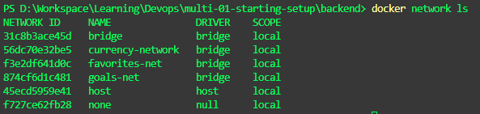
    
  -B2 : Run mongo container trong network vừa tạo  `docker run --name mongodb --rm -d --network goals-net mongo`
   + Lưu ý 1: Khi stop container docker thì dữ liệu mà submit form sẽ mất. Do đó cần phải thêm volume khi run mongoDB container.
     Do đó câu lệnh run container mongodb đúng là như sau : 
    `docker run --name mongodb -v data:/data/db --rm -d --network goals-net mongo`

   + Lưu ý 2 : Cần phải authen cho mongo container = username password như sau :
  `docker run --name mongodb -v data:/data/db --rm -d --network goals-net -e MONGO_INIT_DB_ROOT_USERNAME=hunglp -e MONGO_INITDB_ROOT_PASSWORD=secret  mongo
`

  -B3 : Run backend trong network vừa tạo :
    Tuy nhiên trước đó cần sửa lại file app.js, sửa lại url tới db : 
    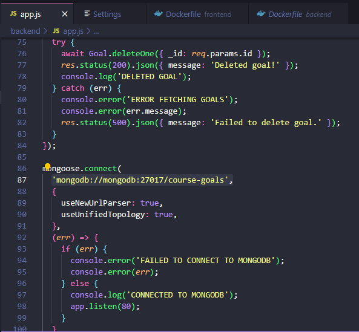
    Ở đây mongodb chính là tên container vừa run ở B2. Ở đây ta vẫn cần phải export cổng 80. Vẫn cần network vì node api call tới DB
    Build lại images rồi run backend :    `docker run --name goals-backend --rm -d --network goals-net -p 80:80 goals-node`
    + Lưu ý: Do mongodb container đã set authen username/password (lưu ý 2 bước 2) Nên lại phải sửa lại app.js như sau : 
    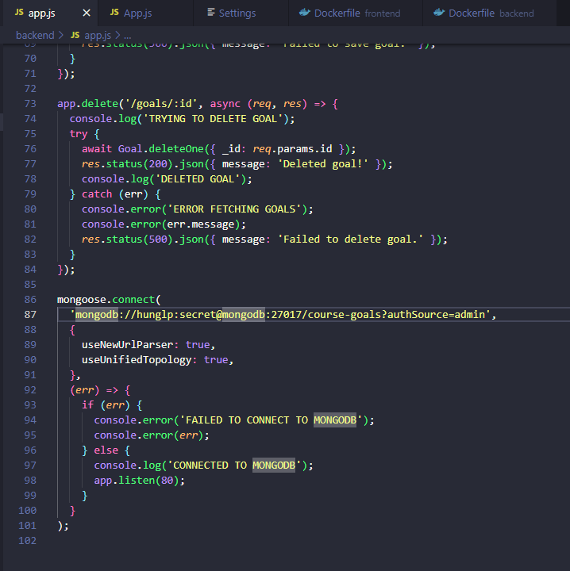
    Build lại images rồi run backend : `docker run --name goals-backend --rm -d --network goals-net -p 80:80 goals-node`
    
  -B4 : Run frontend trong network vừa tạo :
   Tuy nhiên cần sửa lại file App.js , sửa lại url tới api mà FE gọi tới BE là localhost. Sau đó vẫn cần phải export cổng 3000
    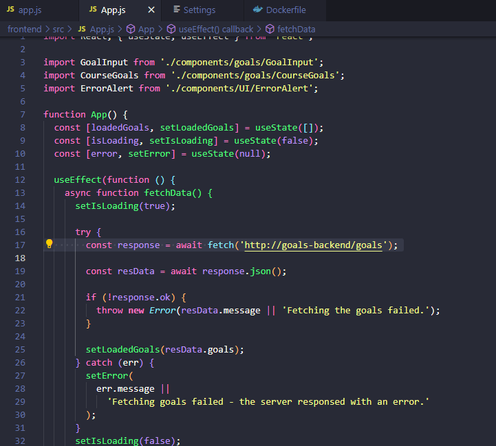
    Build lại images rồi run frontend container `docker run --name goals-frontend --rm -d --network goals-net -p 3000:3000 goals-react`
    
  =============
   Giải thích lý do vì sao vẫn cần phải export port : Vì tại file app.js trong backend. Code ko chạy trong container, mà nó chạy trên web browser, docker ko giúp run code trên web browser 
   => Kết quả : 
   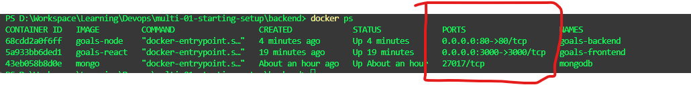

# **Phần 3 : Build multi container bằng DockerCompose**
[Source code :](/compose-01-starting-setup) 
1. Những lưu ý khi dùng dockercompose để build thay cho cách 2 : 
    
- Docker run container với lệnh  ` -d (detach mode)`
- Docker run container với ` --rm (tự động remove khi stop container)`
- Tự động tạo network cho tất cả các service trong file dockercompose.yml

2. Lệnh để chạy dockercompose ; 
    `docker compose up -d`

3. Lệnh để stop all services: (Ở đây sẽ xóa container, xóa network nhưng chưa xóa volume)
   ` docker compose down`
 => Để stop all services đồng thời xóa luôn volume dùng lệnh sau :` docker compose down -v` (tuy nhiên k nên dùng vì sẽ xóa hết data trong volume)

4. Lệnh để chỉ chạy 1 service trong khi docker compose khai báo nhiều services :
    
    `docker compose run <tên_service>` (Ở đây sẽ k xóa contaienr khi stop container)
   => Muốn container bị remove khi bị stop thì dùng lệnh --rm  : `docker compose run --rm <tên_service>`

docker-compose.yaml : (Nằm trong project : compose-01-starting-setup)
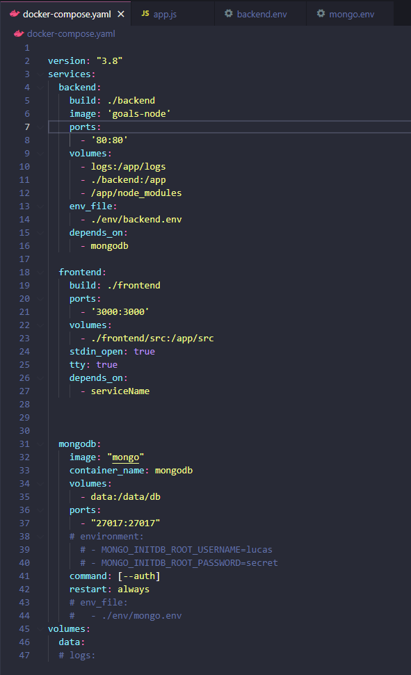

# **Phần 4 : Build multi container khó :D Laravel PHP Nginx**
**Sơ đồ cấu trúc :** 
[Folder thực hành : ](./Practive_Multiple_container_laravel_php_nginx)
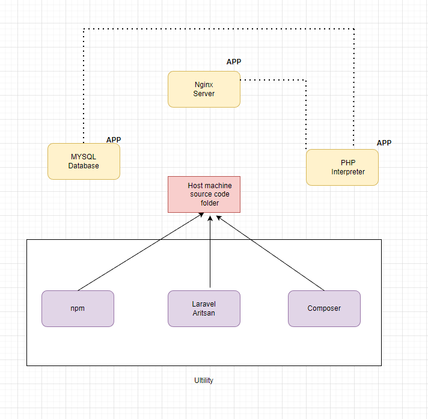
1. Nginx Container :
    
     [Source code : laravel-01-added-nginx](./laravel-01-added-nginx)
     [Nginx config : nginx.conf](./nginx.conf)
2. PHP Container
3. MySQL Container
 => Khai báo 3 services trong dockerfiles như sau : 
  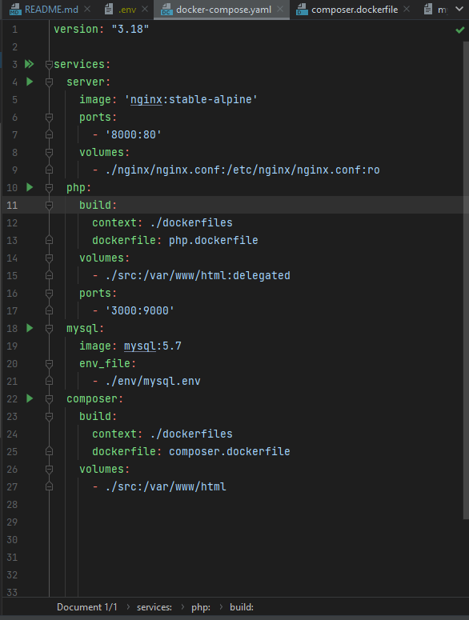
4. Khởi tạo Laravel App dựa trên Composer Ultility :
  `docker-compose run --rm composer create-project --prefer-dist laravel/laravel .`
 => Source code được khởi tạo trong thư mục src:
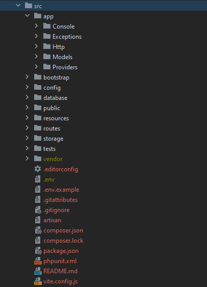
5. Sửa lại url MYSQ trong file src/.env :
    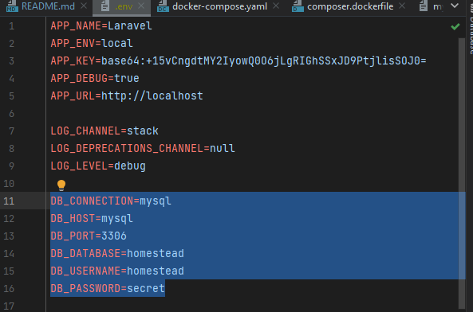
6. Run 3 container : server, php , mysql
   `docker-compose up -d server php mysql`
 => Kết quả : localhost:8000
    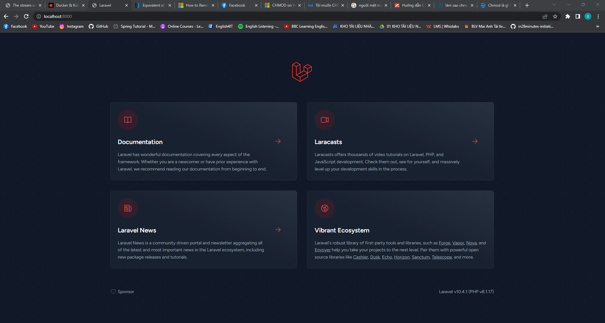
   (Lưu ý : Dùng lệnh sau để build lại các service khi thay đổi các file dockerfile của từng service) : `docker-compose up -d --build server php mysql`

# **Phần 5: Deploy container lên AWS EC2**

1. Một số thông tin AWS EC2 :
   Amazon Elastic Compute Cloud (Amazon EC2) là một cơ sở hạ tầng điện toán đám mây được cung cấp bởi Amazon Web Services (AWS) giúp cung cấp tài nguyên máy tính ảo hoá theo yêu cầu.
   Amazon EC2 cung cấp các ứng dụng máy tính ảo hoá có thể mở rộng về khả năng xử lý cùng các thành phần phần cứng ảo như bộ nhớ máy tính (ram), vi xử lý, linh hoạt trong việc lựa chọn các phân vùng lưu trữ dữ liệu ở các nền tảng khác nhau và sự an toàn trong quản lý dịch vụ bởi kiến trúc ảo hoá đám mây mạnh mẽ của AWS.
   Amazon EC2 sẽ cung cấp một hoặc máy chủ ảo có thể kết hợp với nhau để dễ dàng triển khai ứng dụng nhanh nhất và đảm bảo tính sẵn sàng cao nhất. Thậm chí về mặt thanh toán bạn dễ dàng biết được các mức chi phí cần thanh toán dựa trên thông tin tài nguyên bạn sử dụng.

2. Các bước Deploy : 
   - Khởi tạo và chạy EC2 Instance, VPC, security group
   - Cấu hình security group để ánh xạ tất cả các port đến WWW
   - Kết nối tới instance, cài đặt docker và chạy container

3. Các bước implemnt deploy lên AWS EC2 : 
[Source code : ](/deployment-01-starting-setup)

- B1 : Build images : 
    `docker build -t node-dep-example .`
- B2 : Run container từ images vừa build
   `docker run -d --rm --name node-dep -p 80:80 node-dep-example`
   => kết quả : 
    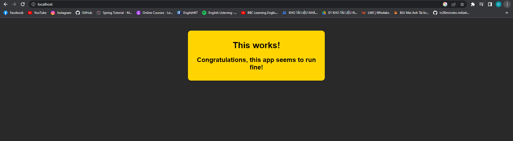

    **Lưu ý 1:**    
Vì sao dùng Bind mounts khi run ở develop và dùng COPY ở Production

- Ở môi trường develop:
    + Container đóng gói môi trường runtime nhưng k cần code
    + Cho phép cập nhật ngay lập tức mà không cần phải khởi động lại container

- Ở môi trường Production, nên dùng COPY vì : 
    + Container hoạt động độc lập, ko cần code ở trên máy remote
    + Đảm bảo rằng tất cả các images chạy mà k cần update thêm cấu hình nào nữa, chỉ việc chạy là xong

**Lưu ý 2 :** 
Có 2 cách deploy : deploy source vs deploy build image

Cách 1 : Deploy source
- Build image trên máy remote
- Đẩy source code lên máy, Run docker build, docker run
- Phức tạp, k cần thiết 

Cách 2: Deploy image
- Build image trước khi deploy (ví dụ build trên máy local)
- Chạy docker run 
- Tránh phải làm việc trên máy host

B3: Tạo file .dockerignore để loại bỏ các file k cần thiết khi push lên dockerhub
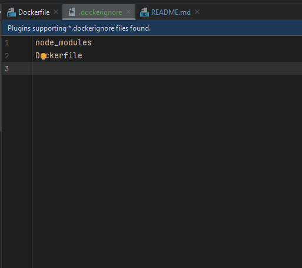

B4: Login docker bằng terminal:

Tại terminal với đường dẫn: D:\Workspace\Learning\Devops\deployment-01-starting-setup>

Run lệnh : `docker login`
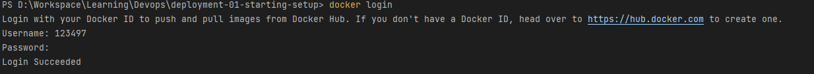

B5: Lên trang docker hub. Tạo repository với tên : _node-example-1_
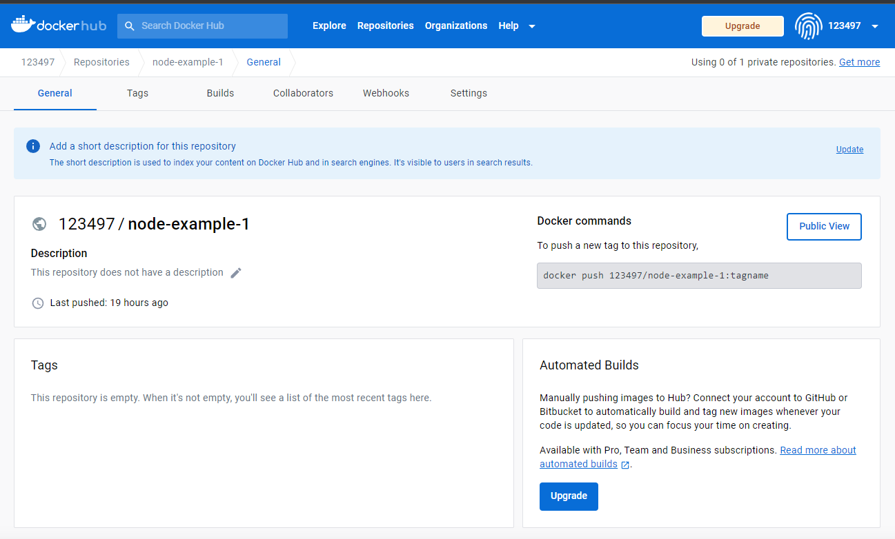

B6. Tại terminal, tag images với tên 123497/node-example-1 chính là username+tên_repository vừa tạo ở B5:

    `docker tag docker-dep-example-1 123497/node-example-1`

-> Kết quả:
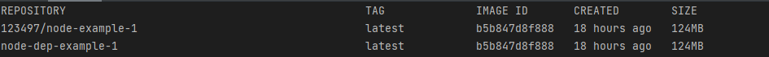

B7: Push lên docker hub:

`docker push 123497/node-example-1`
    
=> **Kết quả** 
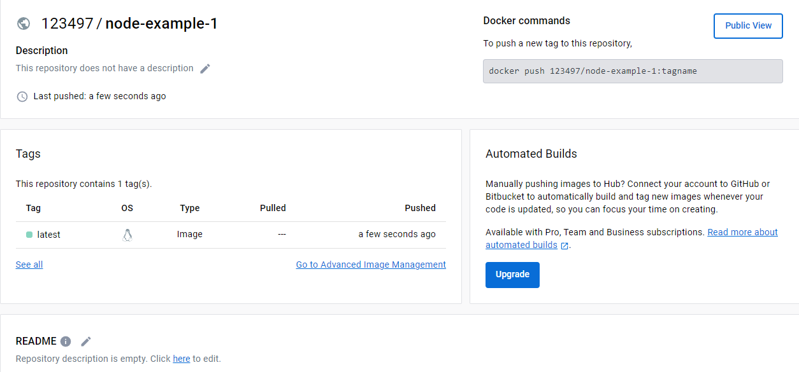

B8. Run images trên remote machine:

Ví dụ tại remote machine, url terminal là _ec2-user@ip-172-31-45-61_:
Run lệnh : 
sudo docker run  -d --rm -p 80:80 123497/node-example-1

