🔥🔥🔥🔥🔥🔥🔥🔥🔥🔥🔥🔥🔥🔥🔥🔥🔥🔥🔥🔥🔥🔥🔥🔥🔥🔥🔥🔥🔥🔥

* ## [PHẦN 1 : Docker cơ bản]()
* ## [Phần 2 : Build multi container]()
* ## [Phần 3 : Build multi container bằng Dockercompose]()
* ## [Phần 4 : Thực hành Build multi container]()
* ## [Phần 5: Deploy container lên AWS EC2]()
* ## [Phần 6: Kubernetes basic]()
* ## [Phần 7: Quản lý data và volumes trong Kubernetes]()
* ## [Phần 8: Kubernetes network]()

🔥🔥🔥🔥🔥🔥🔥🔥🔥🔥🔥🔥🔥🔥🔥🔥🔥🔥🔥🔥🔥🔥🔥🔥🔥🔥🔥🔥🔥🔥

## [PHẦN 1 : Docker cơ bản]()

Có 2 cách lưu trữ dữ liệu từ container ra ngoài máy host:

#### 1.Docker volumns : 

Là folder ở máy host mà được mounted và mapped vào trong container

Khi thêm volumns vào trong container. Volumns sẽ không bị xóa đi khi container bị xóa -> Cho phép persist data mặc dù container đã bị shutdown

- Start container cùng với đường dẫn volumes xác định(Ở đây tên volumes là "feedback") :

  `docker run -d -p 3000:80 --rm --name feedback-app -v feedback:/app/feedback feedback-node:volumes`

- Kiểm tra volumes vừa tạo ở máy host:
  `doker volume ls`

#### 2. Bind mounted :

Về cơ bản khi run container. Giả sử cần sửa file ở máy host, thì app được build ở máy host không ăn theo code

Mỗi lần sửa code cần phải build lại images, sau đó run lại container -> Việc này là rất cồng kềnh

- Bind mounted tương  tự như volume nhưng có một điểm khác : 
		
Volume được quản lý bởi docker, Ta không thể biết được đường dẫn folder chứa volume ở máy host.
Với bind mounted ta biết được điều đó, vì do chính ta xác định đường dẫn đó
		
Ánh xạ volume trong container sang volume ở máy host : 
			
`docker run -d -p 3000:80 --rm --name feedback-app -v feedback:/app/feedback -v D:/Workspace/Learning/Devops/data-volumes-01-starting-setup:/app  feedback-node:volumes`
		
		
Summary : 
- anonymous volume (Ở đây data chính là đường dẫn volumne folder) : `docker run -v /app/data ...`
- named volume (Ở đây data chính làđường dẫn volumne folder, some-name chính là tên của volume) :  `docker run -v some-name:/app/data ...`
- Bind mounted:  `docker run  -v /path/to/code:/app/code ...`
		
      
VD :Create images:
		
 `docker run -d --rm -p 3000:80  --name feedback-app -v feedback:/app/feedback -v "D:/Workspace/Learning/Devops/data-volumes-01-starting-setup:/app:ro" -v /app/node_modules -v /app/temp  feedback-node:env`

#### 3. Dockerignore

   không nên copy tất cả các file từ máy host vào container.
   .Dockerignore xác định file hoặc folder nào không nên coy bởi lệnh COPY trong Dockerfile

   Ví dụ : node_modules không nên copy vào container. Nên để node_modules vào .dockerignore

#### 4. Environ variable

Trong docker file có thể set environment bằng lệnh :' "ENV"
ví dụ : ENV PORT 80

- Ngoài ra có thể set env ngay trong lệnh run container :

`  docker run -d --rm -p 3000:80 --env PORT=80  --name feedback-app -v feedback:/app/feedback -v "D:/Workspace/Learning/Devops/data-volumes-01-starting-setup:/app:ro" -v /app/node_modules -v /app/temp  feedback-node:env
`

- Ngoài ra cũng có thể tạo một file .env sau đó set PORT = 80 trong file đó

Khi đó, run docker thêm lệnh : "--env-file ./.env"

`docker run -d --rm -p 3000:80 --env-file ./.env  --name feedback-app -v feedback:/app/feedback -v "D:/Workspace/Learning/Devops/data-volumes-01-starting-setup:/app:ro" -v /app/node_modules -v /app/temp  feedback-node:env
`

#### 5. Argument variable

- Sử dụng ARG:

   Trong docker file có thể set argument bằng lệnh "ARG"

   Ví dụ : 
   ARG DEFAULT_PORT = 80
   EXPOSE $DEFAULT_PORT

#### 6. Docker network :

[source code : networks-starting-setup ](/networks-starting-setup)

PostMan:  

- "host.docker.interal" là host local bên trong container docker

- Pull docker DB : `docker pull mongo`

- Run docker container từ mongo Images :  ` docker run  -d --name mongodb mongo`

- Build images từ file source code : `docker build -t favorites-node .`
- Run container từ images "favorites-node" vừa tạo :  `docker run --name favorites -d --rm -p 3000:3000 favorites-node` 
- Kiểm tra container :

- 
Theo cách đơn giản. Kiểm tra thông tin mongodb container bằng lệnh : `docker container inspect mongodb `
Sau đó pase IP network của docker vào thông tin config DB như hình dưới

Khi đó contaienr đã kết nối được với Database mongoDB

Nhưng không ai dùng cách này cả. Best practive là tạo một network chung. Trong network đó chứa 2 container là : container của app, container của mongodb

- Tạo network : `docker network create favorites-net`
- Run mongodb container dưới nền network vừa tạo : `docker run -d --name mongodb --network favorites-net mongo`
- Run app container dưới nền network vừa tạo :
  Cần sửa lại đường dẫn url connect DB như sau : (mongodb là tên của container mongodb vừa run ở trên)
 
- Sau đó build lại images, run lại app container( Lưu ý ở đây cần thêm tham số --network ): `docker run --name favorites --network favorites-net -d --rm -p 3000:3000 favorites-node`

---------------------------------------------------------------------------------------------------------------

## **PHẦN 2: Build multi container**
[Source code :](/multi-01-starting-setup) 

#### - B1 : Run Mongodb container : 

    `docker run --name mongodb --rm -d -p 27017:27017 mongo`

####  B2 : Dockerize backend:
   -  Tạo Dockerfile : 
      + 
   -  Trong file app.js, Update url connect mongo : 
      +  
   -  Build image : `docker build -t goals-node .`
   -  Run container từ images vừa build : `docker run --name goals-backend --rm -d -p 80:80 goals-node`
  
#### - B2 : Dockerize Frontend:

   -  Tạo Docker file
       + 
   -   Build image : `docker build -t goals-react .`
   -   Run container từ images vừa build : `docker run --name goals-frontend --rm -d -p 3000:3000 goals-react`
   -  Kết quả : 
      + 
   - Note : Nhận thấy 3 cách run container trên đều cần export port
 
     + => Bình thường cũng k ai làm ntn. Best practive là run 3 container dưới 1 network, khi đó thì sẽ k cần export
 
[Best practive]:

####  - B1 : 

   + Tạo network  `docker network create goals-net`
   + Kiểm tra : `docker network ls`
     
    
####   -B2 : Run mongo container trong network vừa tạo 
`docker run --name mongodb --rm -d --network goals-net mongo`
   + Lưu ý 1: Khi stop container docker thì dữ liệu mà submit form sẽ mất. Do đó cần phải thêm volume khi run mongoDB container.
     Do đó câu lệnh run container mongodb đúng là như sau : 
    `docker run --name mongodb -v data:/data/db --rm -d --network goals-net mongo`

   + Lưu ý 2 : Cần phải authen cho mongo container = username password như sau :
  `docker run --name mongodb -v data:/data/db --rm -d --network goals-net -e MONGO_INIT_DB_ROOT_USERNAME=hunglp -e MONGO_INITDB_ROOT_PASSWORD=secret  mongo
`

#### B3 : Run backend trong network vừa tạo :

   -  Tuy nhiên trước đó cần sửa lại file app.js, sửa lại url tới db : 
   +   
   - Ở đây mongodb chính là tên container vừa run ở B2. Ở đây ta vẫn cần phải export cổng 80. Vẫn cần network vì node api call tới DB
   - Build lại images rồi run backend :    `docker run --name goals-backend --rm -d --network goals-net -p 80:80 goals-node`
   - Lưu ý: Do mongodb container đã set authen username/password (lưu ý 2 bước 2) Nên lại phải sửa lại app.js như sau : 
     + 
   - Build lại images rồi run backend : `docker run --name goals-backend --rm -d --network goals-net -p 80:80 goals-node`
    
####   -B4 : Run frontend trong network vừa tạo :

  - Tuy nhiên cần sửa lại file App.js , sửa lại url tới api mà FE gọi tới BE là localhost. Sau đó vẫn cần phải export cổng 3000
    + 
    + Build lại images rồi run frontend container `docker run --name goals-frontend --rm -d --network goals-net -p 3000:3000 goals-react`
  - Giải thích lý do vì sao vẫn cần phải export port : Vì tại file app.js trong backend. Code ko chạy trong container, mà nó chạy trên web browser, docker ko giúp run code trên web browser 
    +=> Kết quả : 
    + 

# **Phần 3 : Build multi container bằng DockerCompose**
[Source code:compose-01-starting-setup](/compose-01-starting-setup) 

#### 1. Những lưu ý khi dùng dockercompose để build thay cho cách 2 : 
    
- Docker run container với lệnh  ` -d (detach mode)`
- Docker run container với ` --rm (tự động remove khi stop container)`
- Tự động tạo network cho tất cả các service trong file dockercompose.yml

#### 2. Lệnh để chạy dockercompose ; 

    `docker compose up -d`

#### 3. Lệnh để stop all services: (Ở đây sẽ xóa container, xóa network nhưng chưa xóa volume)

   ` docker compose down`
 => Để stop all services đồng thời xóa luôn volume dùng lệnh sau :` docker compose down -v` (tuy nhiên k nên dùng vì sẽ xóa hết data trong volume)

#### 4. Lệnh để chỉ chạy 1 service trong khi docker compose khai báo nhiều services :
    
    `docker compose run <tên_service>` (Ở đây sẽ k xóa contaienr khi stop container)
   => Muốn container bị remove khi bị stop thì dùng lệnh --rm  : `docker compose run --rm <tên_service>`

docker-compose.yaml : (Nằm trong project : compose-01-starting-setup)

# **Phần 4 : Thực hành  build multi container**
**Sơ đồ cấu trúc :** 
[Folder thực hành : ](./Practive_Multiple_container_laravel_php_nginx)

#### 1. Nginx Container :
    
     [Source code : laravel-01-added-nginx](./laravel-01-added-nginx)
     [Nginx config : nginx.conf](./nginx.conf)

#### 2. PHP Container

#### 3. MySQL Container

 => Khai báo 3 services trong dockerfiles như sau : 
  

#### 4. Khởi tạo Laravel App dựa trên Composer Ultility :

  `docker-compose run --rm composer create-project --prefer-dist laravel/laravel .`
 => Source code được khởi tạo trong thư mục src:

#### 5. Sửa lại url MYSQ trong file src/.env :

    

#### 6. Run 3 container : server, php , mysql

   `docker-compose up -d server php mysql`
 => Kết quả : localhost:8000
    
   (Lưu ý : Dùng lệnh sau để build lại các service khi thay đổi các file dockerfile của từng service) : `docker-compose up -d --build server php mysql`

# **Phần 5: Deploy container lên AWS EC2**

#### 1. Một số thông tin AWS EC2 :

   Amazon Elastic Compute Cloud (Amazon EC2) là một cơ sở hạ tầng điện toán đám mây được cung cấp bởi Amazon Web Services (AWS) giúp cung cấp tài nguyên máy tính ảo hoá theo yêu cầu.
   Amazon EC2 cung cấp các ứng dụng máy tính ảo hoá có thể mở rộng về khả năng xử lý cùng các thành phần phần cứng ảo như bộ nhớ máy tính (ram), vi xử lý, linh hoạt trong việc lựa chọn các phân vùng lưu trữ dữ liệu ở các nền tảng khác nhau và sự an toàn trong quản lý dịch vụ bởi kiến trúc ảo hoá đám mây mạnh mẽ của AWS.
   Amazon EC2 sẽ cung cấp một hoặc máy chủ ảo có thể kết hợp với nhau để dễ dàng triển khai ứng dụng nhanh nhất và đảm bảo tính sẵn sàng cao nhất. Thậm chí về mặt thanh toán bạn dễ dàng biết được các mức chi phí cần thanh toán dựa trên thông tin tài nguyên bạn sử dụng.

#### 2. Các bước Deploy : 

   - Khởi tạo và chạy EC2 Instance, VPC, security group
   - Cấu hình security group để ánh xạ tất cả các port đến WWW
   - Kết nối tới instance, cài đặt docker và chạy container

#### 3. Các bước implement deploy lên AWS EC2 : 

[Source code :deployment-01-starting-setup ](/deployment-01-starting-setup)

- B1 : Build images : 
    `docker build -t node-dep-example .`
- B2 : Run container từ images vừa build
   `docker run -d --rm --name node-dep -p 80:80 node-dep-example`
   => kết quả : 
    

    **Lưu ý 1:**    
Vì sao dùng Bind mounts khi run ở develop và dùng COPY ở Production

- Ở môi trường develop:
    + Container đóng gói môi trường runtime nhưng k cần code
    + Cho phép cập nhật ngay lập tức mà không cần phải khởi động lại container

- Ở môi trường Production, nên dùng COPY vì : 
    + Container hoạt động độc lập, ko cần code ở trên máy remote
    + Đảm bảo rằng tất cả các images chạy mà k cần update thêm cấu hình nào nữa, chỉ việc chạy là xong

**Lưu ý 2 :** 
Có 2 cách deploy : deploy source vs deploy build image

Cách 1 : Deploy source
- Build image trên máy remote
- Đẩy source code lên máy, Run docker build, docker run
- Phức tạp, k cần thiết 

Cách 2: Deploy image
- Build image trước khi deploy (ví dụ build trên máy local)
- Chạy docker run 
- Tránh phải làm việc trên máy host

B3: Tạo file .dockerignore để loại bỏ các file k cần thiết khi push lên dockerhub

B4: Login docker bằng terminal:

Tại terminal với đường dẫn: D:\Workspace\Learning\Devops\deployment-01-starting-setup>

Run lệnh : `docker login`

B5: Lên trang docker hub. Tạo repository với tên : _node-example-1_

B6. Tại terminal, tag images với tên 123497/node-example-1 chính là username+tên_repository vừa tạo ở B5:

    `docker tag docker-dep-example-1 123497/node-example-1`

-> Kết quả:

B7: Push lên docker hub:

`docker push 123497/node-example-1`
    
=> **Kết quả** 

B8. Run images trên remote machine:

Ví dụ tại remote machine, url terminal là _ec2-user@ip-172-31-45-61_:
Run lệnh : 
sudo docker run  -d --rm -p 80:80 123497/node-example-1

# **Phần 6: Kubernetes basic**

#### 1. Khái niệm :

   - Là 1 platform deploy, scaling, quản lí các ứng dụng hoạt động dựa trên container
   - Các ứng dụng cos thể khác nhau về kích thước, lên tới hàng nghìn server

#### 2. Lợi ích chủ yếu:

   - Điều phối container, k8s đảm bảo tất cả các container chạy trên các server (Physical machine, Virtual Hoạt đônộng)
   - Theo dõi hoạt động của từng container, Khi container nào đó bị trục trặc, K8s tự động chạy lại container đó
   
#### 3. Các thành phần trong K8s cluster

   - Cluster:
     + 1 tập hợp các máy nodes mà ang chạy container ( worker node) và quản lý các master node
   - Node: 
     + Là máy vật lý  hoặc mays ảo lưu trữu một hoặc nhiều Pods và duy trì kết nối với Cluster
   - Pod: 
     + Pod là đơn vị nhỏ nhất trong kubernets
     + Pod chứa một hoặc nhiều container
     + Pod có thể kết nối với các pod khác thông qua IP
     + Chứa volumes
     + Các container bên trong host có thể giao tiếp thông qua localhost
   - Worker Nodes:
     + Có thể hiểu là virtual machine, host machine, ec2 instance... dùng để chạy container(Run Pod)
     + Có một hoặc nhiều pod chạy trên một worker nodes
     + Tương tự, có thể có nhiều worker node chạy trên các port khác nhau
     + kubelet : Tạo kết nối giữa Worker node và master node
     + kubeproxy : Quản lý node và kết nối của pod
   - Master Nodes:
     + Bao gồm các thành phần sau:
        + API Server : LÀ 1 API để kubelets kết nối
        + Theo dõi các Pods mới, Xác định Worker Node để chạy Pod mới đó
        + Kube Controller Manager: Theo dõi và điều khiển các Workernodes đảm bảo số lượng Pods
        + Cloud Controller Manager : 
     +  
     + Vai trò chính của Master Node: 
         Tạo và start pods, thay thế nếu pods dừng hoạt động) của các worker node
   - Proxy : 
     + Thành phần trong Worker Node,để điều khiển, quản lý lưu lượng mạng, Đảm bảo các Pod chạy trên internet
   - Services:
     + 
     

#### 4. Những việc mà Kubernetes làm và Dev cần làm
  - Kubernetes làm:
      + Tạo ra các pods và quản lý pods
      + Giám sát pods và khởi tạo lại chúng nếu có vấn đề, scale pods
  - Dev làm:
    + Tạo cluster và Node instance ( worker node, master node)
    + Cấu hình API server, kubelet và các kubernetes services khác, hoặc các phần mềm trên nodes
    + Tạo các cloud resources cần thiết ( Load balancer, File System)

#### 5.  Tìm hiểu về "Services" Object

  - Services Object Expose Pods tới cluster hoặc ra bên ngoài
  - Bởi vì mỗi pod có một IP address riêng đặc biệt là khi scalling pod thì mỗi IP của pod sẽ thay đổi
  - Do đó Servervices có trách nhiệm nhóm các pod cùng với 1 share IP. Thằng share IP này là của service, nó ko thay đổi
  - Services cho phép các mạng bên ngoài truy cập tới pod

#### 6. Cài đặt kubernetes và minikube

  - Active kubenetes trên docker desktop:
        
  - Cài đặt minikube (Xem hướng dẫn trên udemy)
    

   
#### 7. Start minikube

  - Mở cmd Administrator
  - Run: `minikube start --driver=hyperv`
       
  - Kết quả :
    +   
  - Run `minikube dashboard`
    + => 
    
#### 8. Example Practive: 

  - Source code : kub-action-01-starting-setup

    - B1: Build images dưới local:
      + cd tới thư mục "kub-action-01-starting-setup"
      + Run lệnh: `docker build -t kub-first-app .`
      + Kết quả: 
        

    - B2: Tạo "Deployment Object" từ image vừa build
    
        + ` kubectl create deployment first-app --image=kub-first-app`
        + => Kết quả:
        + 
        + Tuy nhiên ta có thể thấy giá trị READY 0/1, tức là ko có deployments nào ready
        + Tiếp tục Kiểm tra Nodes bằng lệnh : `kubectl get pods` 
        + => Kết quả:
        + 
        + Tuy nhiên ta có thể thâ là READY 0/1, tức là ko có pods nào ready
          + => Lý do là khi run lệnh tạo deployments, thì images phải là images cluster, còn images đang truyền vào là 'kub-first-app' lại là images ở dưới local
          + => Do đó cần push images local lên docker hub
          + => Trước tiên xóa deployments first-app rồi làm lại B2
        +  Xóa deployments bằng lệnh: `kubectl delete deployment first-app`

  - B2 (fix): Push images kub-first-app lên dockerhub
      + Login docker hub bằng account : lephihung0997@gmail.com/Hungphile@9397
      + Tạo repository: kub-first-app
      + ==>
      + Tag images từ image kub-first-app bằng lệnh :`docker tag kub-first-app 123497/kub-first-app`
      + ==> 
      + Push lên docker hub: `docker push 123497/kub-first-app`

  - B3 : Tạo "Deployment object "
    + Tạo deployments: `kubectl create deployment first-app --image=123497/kub-first-app`
    + Get list deployments: `kubectl get deployments`
    + Get Node : `kubectl get pods`
    +  => Kết quả:
    + 

  - B4 : Kiểm tra  minikube dashboard:

    
     (Như hình trên là làm đúng)
  - B5: Expose Deployment to Service
    + Run:  `kubectl expose deployment first-app --port=8080 --type=LoadBalancer`
    (8080 là port của app.listen(8080) đc khai báo trong  file app.js)
    + Lưu ý:
      + type=ClusterIP(defaultType): tức là Chỉ có thể truy cập bên trong cụm cluster, và IP address cung cấp cho services này sẽ ko thể thay đổi
      + type=NodePort : tức là deployment vừa tạo ở trên chỉ có thể expose bằng IP của WorkerNode
      + type=Loadbalancer : tức là sẽ gen 1 IP address 
    + Check services : `kubectl get services`
    + ===> Kết quả:
    + 
  - B6 : Run app service:
    + Run trên cmd administrator : `minikube service first-app`
    + Kq : 
    + 
    + 

   - B7 : Test chức năng restart container:
     + Trong file app.js có đoạn code:
     + `app.get('/error', (req, res) => {
       process.exit(1);
       });`
     + Tức là khi truy cập url /error thì chương trình sẽ dừng hoạt động
     + 
     + Tuy nhiên chỉ cần đợi 1 lúc thì container sẽ tự động restart (Lưu ý thời gian mỗi lần restart sau đó sẽ càng thêm lâu hơn để tránh khỏi vòng lặp vô hạn)
     + =>> Kq : Container tự động restart thành công
     + 

   -  B7: Scaling
      + Run `kubectl scale deployment/first-app --replicas=3`  (3 pods)
      + Kiểm tra : `kubectl get pods`
      + 
      + Ta có thể thấy ở hình trên. 2 pods mới được sinh ra với số lần restart = 0
      + Tác dụng lớn nhất của việc Scaling là:
        + Khi ta truy cập đến /error (như B6) thì 1 pods sẽ chết, Tuy nhiên ta ko phải  đợi quá lâu đ cho pods đó restart lại
        + Bởi vì, Ta còn 2 pods khác READY (2 pods này chạy trên 2 IP khác nhau) 
   
   -  B8: Cập nhật Deployment
      + Bình thường, ta cần sưả đổi code dưới local
      + Sau khi update xong. Run lệnh sau : `docker build -t 123497/kub-first-app:2 .` (Cần tag version mới cho image mới này)
      + Push image mới lên docker hub: `docker push 123497/kub-first-app:2`
      + ==> kết quả trên docker hub : 
      + Để update deployment. Run: `kubectl set image deployment/first-app kub-first-app=123497/kub-first-app:2`
      + Sau khi update xong. Ta có kết quả:
      +  (Nhiá»u dấu chấm than)
      + Bonus: Ta có thể trace trên minikube dash board, các event diễn ra:
      + 

   -  B9: Tạo file config Deployment
      + Đặt vấn đề : Ta thực hiện rất nhiều bước (Từ B1 -> B8 để thực hiện run app) -> Rất mất tgian và cũng k đảm bảo  => Do đó cần tạo config deployment vào file config
      + Tiền đề : Xóa service và deployments
      + 
      + Trong thư mục project "kub-action-01-starting-setup", Tạo file deployment.yaml

   - B10: Run Deployment config file
      + Tạo deployment bằng lệnh :` kubectl apply -f deployment.yaml`
      + Cấu hình như ảnh dưới đây:
      + 
      + Kiểm tra deployments vừa tạo : `kubectl get deployments`
      + 

   - B11: tạo file services.yaml và run file config service
      +  Trong thư mực project "kub-action-01-starting-setup", Tạo file service.yaml
      + Cấu hình như ảnh Sau:
      + 
      + Tạo service bằng lệnh `kubectl apply -f service.yaml`
      + Kiểm tra service vừa tạo: `kubectl get service`
      + 

     =========>>>>>>>>
     + Cuối cùng, Expose Service vừa tạo để chạy app:
     + (Run bbằng cmd Administrator) `minikube service backend` (backend là tên ở metadata trong File service.yaml)
     + 
     + DONE~
        
      ==========================

     +  Bonus1. cách xóa deployment và services
         + Chạy lệnh sau : kubectl delete -f deployment.yaml -f service.yaml
     + Bonus2 : Có thể gộp file service.yaml và deployment.yaml thành một
         + Cách làm: Tạo file master-deployment.yaml
         + Cấu hình như sau: 
         + 
         + Xóa deployment và service bằng lệnh : `kubectl delete -f deployment.yaml -f service.yaml`
         + Apply lại file master-deployment.yaml vừa tạo bằng lệnh: `kubectl apply -f master-deployment.yaml`

# **Phần 7: Quản lý data và volumes trong Kubernetes**

[Source Code : ](/kub-data-01-starting-setup) _kub-data-01-starting-setup_

1. **Kiến thức cơ bản về Volumes trong kubernetes**
    - K8S có thể mount volumes vào trong container
    - Vòng đời của volume phụ thuộc vào vòng đời của Pod
    - Volume sẽ bị xóa khi Pod bị xóa
    - So sánh khác nhau giữa "Kubernetes Volume" và "Docker Volume"
       + Kubernetes Volume:
            + Hỗ trợ nhiều driver và các types khác nhau, Ta nắm được data được lưu ở đâu( các môi trường khác nhau, trên AWS)
            + Volumes bảo đảm container restart, nhưng k bảo đảm pod restart
       + Docker Volume
            + Không hỗ trợ nhiều môi trường( chỉ có local hoặc dev)
            + Volumes sẽ tồn tại mãi mãi trên machine nào đó ( Trừ khi cài lại os, reset máy)
2. **Build Images và run app:**
    - cd tới thư mục kub-data-01-starting-setup (Quyền administrator)
    - Run lệnh : `docker-compose up -d --build`
    - Kết quả: 
    - 
    - 
    - 
    - Lưu ý: Trong file docker-compose.yaml đã khai báo volumes =>  Nên là Khi Dừng container bằng lệnh: `docker-compose down`, Sau đó run  lại (`docker-compose up`) thì data vẫn còn đó
3. **Tạo deployment và services**
    - cd tới thư mục kub-data-01-starting-setup ( Quyền administrator)
    - Tạo file deployment.yaml
    
    - Tạo file service.yaml
    
    - Tạo repository trên Docker hub với tên : `kub-data-demo`
    - Kết quả: 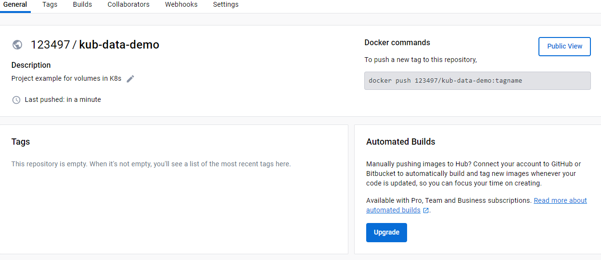
    - Build docker images bằng lệnh : `docker build -t 123497/kub-data-demo .`
    - Push images lên docker hub bằng lệnh: `docker push 123497/kub-data-demo`
    - Kết quả: 
    - Vẫn trong đường dẫn thư mục đó, Apply file service.yaml và deployement.yaml bằng lệnh: `kubectl apply -f service.yaml -f deployment.yaml`
    - Run app bằng lệnh: `minikube service story-service` (story-service chính là metadata name trong file service.yaml)
    - Kết quả: 
    - 
    - Ta có thể thấy App đã được chạy trên host http://172.18.10.209:32303
    - Call thử api trên host http://172.18.10.209:32303
    - Kết quả:
    - 
4. **Tìm hiểu volume : "emptyDir"**
    - Trong file app.js có định nghĩa một route dừng app như sau:
        `app.get('/error', () => {
      process.exit(1);
      });`

    - Build lại image với tag mới bằng lệnh sau: `docker build -t 123497/kub-data-demo:1 .`
    - Sau đó push lên dockerhub: `docker push 123497/kub-data-demo:1`
    - 
    - Update file deployment với images tag mới:
    - 
    - Apply lại deployment.yaml : `kubectl apply -f deployment.yaml`
    - Sau khi apply lại file deployment mới này, thì một pod mới sẽ được tạo mới lại với container mới
    - Kiểm tra pod: `kubectl get pods`
    - 
    - Trước khi apply deployment chứa images mới
    - API Get Story đang như sau:
    - [img_78.png](images/img_78.png)
    - Sau khi gọi đến đường dâẫn /error
    - Thì API Get Story như sau:
    - 
    - Giải thích: Khi container được restart(Do build lại images mới) , k phải lả restart pods -> Khi đó data của container sẽ bị mất => Do đó cần volumes
    - Thêm volumes config vào file deployment.yaml như sau:
    - 
    - Apply lại file deployment.yaml:`kubectl apply -f deployment.yaml`
    - Sau đó call lại API POST: 
    - API GET : 
    
    - =>> **Tổng kết:** Sau khi Fix xong, Ngay cả khi gọi API /error (Dẫn đến container restart) thì API GET vẫn trả ra đúng kết quả, Do data đã đc ghi lại dưới volumes
   
5.   **Tìm hiểu volume "hostPath"**
   - Đặt vấn đề : ở ví dụ trước podsReplica chỉ là 1
   - Khi đó Mỗi lần truy cập đến API URL /error thì ta phải đợi cho container restart, 
   - Trong tgian đợi đó thì lúc ta gọi API GET /story th kết quả sẽ chưa có do container chưa start xong

   - Cách dùng emptyDir volume chỉ phù hợp với 1 podsReplica
   - Khi ta có nhiều podsReplica, ta cần chia sẽ dữ liệu giữa các pods với nhau, để đảm bảo trong thời gian pod này chết, thì pod khác ngay lập tức được dùng và có data ở trong volumes
   - Sửa file deployment.yaml như sau:
   - 
   - (Trong hình trên ta khai báo 2 pods replica và Thay đổi volume type là hostPath)

6. **Tìm hiểu persistent volumes (Hay sử dụng cách này nhất)**
    - Đặt vấn đề: 
      + Với emptyDir,  volumes sẽ bị xóa khi mà Pods bị xóa hoặc Khi scale pods từ 1 pods thành nhiều pods, thì pods mới tạo sẽ không có data
      + Với hostPath, thì minikube chỉ hoạt động với 1 worker Node, Do đó khi chạy trên môi trường thật như AWS thì Node mới sẽ ko có data
    - Pod và Node độc lập với Volume
   - Persistent Volumes giải quyết được vấn đề này:
         + 
         + Ta ko lưu data trong Node, Mà lưu data trong Cluster
         + Có một persistent Volume Claim trỏ tới volume trong cụm Cluster đó ( như hình)
         + Cách này làm cho Volumes độc lập và không phụ thuộc vào Node hoặc pods
7.  **Sử dụng Persistent Volumes**
    -  [Source: kub-data-01-starting-setup](kub-data-01-starting-setup)
    - cd tới thư mục project : kub-data-01-starting-setup
    - Tạo Persistent Volume: Tạo file host-pv.yaml
    - 
    - Tạo Persistent Volume Claim: Tạo file host-pvc.yaml
    - 
    - Sửa lại file deployment.yaml như sau:
    - 
    - Apply host-pv.yaml, host-pvc.yaml, deployment.yaml:
      + kubectl apply -f=host-pv.yaml
      + kubectl apply -f=host-pvc.yaml
      + kubectl apply -f=deployment.yaml
    ==== Xong
     
   -  Tổng kết:
    + So sánh "Volume thường" và "Persistent Volume
        + Volume thường:
          + Được đính kèm vào pod và vòng đời của Pod, Khi Pod bị xóa thì data trong volume cũng sẽ bị xóa
          + Được định nghĩa và khởi tạo cùng với Pod
          + Nếu có nhiều Pods, nhiều deployments thì sẽ cần khai báo nhiều lần volume
        
        + PersistentVolumes:
          + Là cụm tài nguyên độc lập, không ảnh hưởng gì tới pods hoặc node
          + Được định nghiax và khởi tạo độc lập (cùng với PersistentVolumeClaim)
          + Chỉ cần khai báo 1 lần và sử dụng được nhiều lần

8. **Sử dụng Environment Variables**

   - Ta có thể khai báo các biến môi trường trong phần configs containers của file deployment.yaml
        + 
        + Sử dụng biến môi trường trong file app.js (folder kub-data-01-starting-setup) : `const filePath = path.join(__dirname, process.env.STORY_FOLDER, 'text.txt');', 'text.txt');`
   - Sau đó sửa lại tag của images thành tag3 : 
   - Build lại images bằng lệnh : `docker build -t 123497/kub-data-demo:3 .`
   - Push tag2 này lên docker hub : `docker push 123497/kub-data-demo:3`
   - Apply lại file deployment.yaml : `kubectl apply -f=deployment.yaml`

   - Kết quả: Pods cũ sẽ bị xóa, và thay thế bằng 2 pods mới:
       + 
       + 
   - ===> Call API vẫn bình thường là đúng

9.  **Sử dụng config maps**
    - Tạo file environment.yaml và config như sau:
        + 
    - Sửa lại file deployment.yaml như sau:
        + 

    - Apply 2 file deployment.yaml và environment.yaml
        + `kubeclt apply -f=environment.yaml`
        + `kubectl apply -f=deployment.yaml`

    - ===> Call API vẫn bình thường là đúng

-------------------------------------------------------------------------
    
# **Phần 7:  Kubernetes network**

#### 1. Resources: 

- [Source code : kub-network-01-starting-setup ](/kub-network-01-starting-setup)
- PostMan folder : _API Test K8s Network_

#### 2. Kiến trúc project:
  - Ý tưởng ban đầu :  Cụm cluster chỉ gồm 2 pod, 
  - 

#### 3. Build images và run container dưới local:
   - `docker-compose up -d --build`
   - Kết quả:
     + 
   - User API, Login : 
      +  
   - Task API, Add Task
      + 
   - Task API, Get Task
     +  

#### 4. Build deployments và services:
- Trên docker hub, Tạo repository : _kub-demo-users_
- Sửa lại code, Build lại images users-api : `docker build -t 123497/kub-demo-users .`
- Push lên docker hub : `docker push 123497/kub-demo-users`
    + 
 
##### 4.1: Apply Deployments cho users-api
- Tạo file users-deployment.yaml trong folder kubernetes
- Trong folder kub-network-01-starting-setup, Apply deployment :  `kubectl apply -f=kubernetes/users-deployment.yaml`
    + 

##### 4.2: Apply Services cho users-api
- Tạo file users-services.yaml trong folder kuberntes
- Trong folder kub-network-01-starting-setup, APPly services : `kubectl apply -f=kubernetes/users-service.yaml`
    + 
- Expose services (cmd line administrator) : `minikube service users-service`
    + 
    + 
    + 

##### 4.3: Apply services cho auth-api
- Tao repository trên dockerhub với tên: _kub-demo-auth_
- cd tới folder auth-api, Build images bằng lệnh : `docker build -t 123497/kub-demo-auth .`
- Push lên hub: `docker push 123497/kub-demo-auth`

##### 4.4 Nhiều containers trong 1 pods
- Đặt vấn đề:
    + 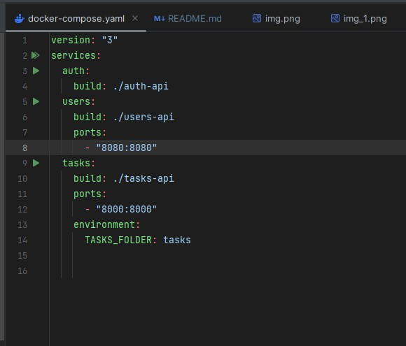
    + Nếu như deploy dưới local( mục 3) thì users-api gọi thông qua được auth-api thoogn qua network
    + Còn khi Build k8s thì ta cần setting network cho các services
    + Tuy nhiên ko khai báo thêm Deployment và Services cho Auth-api
    + Mà trong user-deployment, ta khai báo nhiều container 
        + 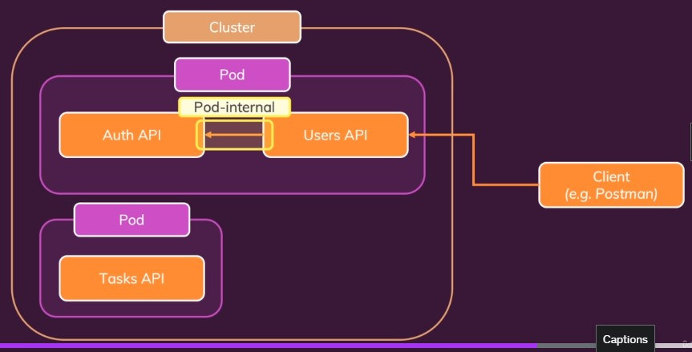
        + 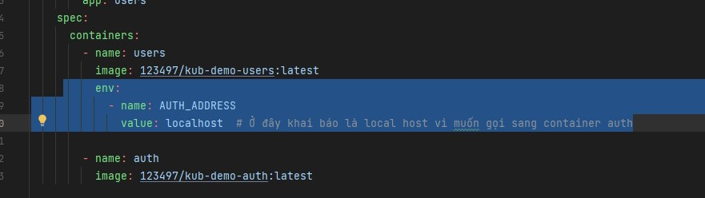
- Ngoài ra, Ta cũng call internal Auth API (Ko muốn expose Auth-API), Do đó cần sửa lại environment như sau: 
    + 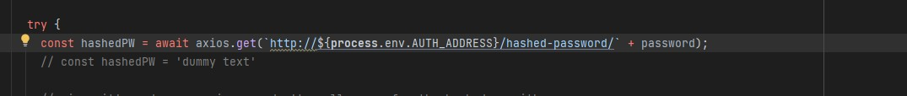
    + 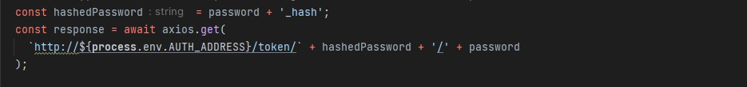
    + 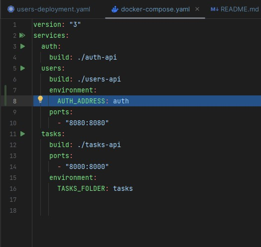
    
- Build lại images (Do update docker-compose)
  +  ` docker build -t 123497/kub-demo-users .`
- Push lại images lên docekr hub : 
  +  `docker push 123497/kub-demo-users`
- APply lại file user-deployment
  + `minikube apply -f=kubernetes/users-deployment.yaml`
  + Kiểm tra: `kubectl get pods`(2 containers trong 1 pods)
    + 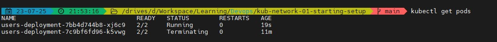
    + 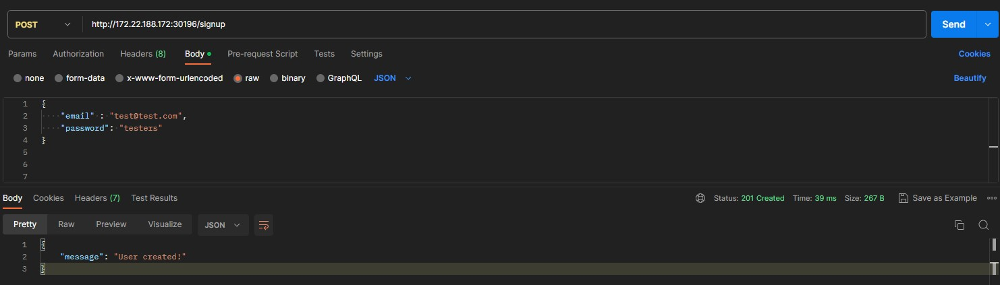
    + 

##### 4.5 Deploy TaskAPI trong Một Pods mới
- Đặt vấn đề : 
  + Thay đổi ý tưởng kiến trúc project thành 3 pods, 3 deployment, 3 services
  + 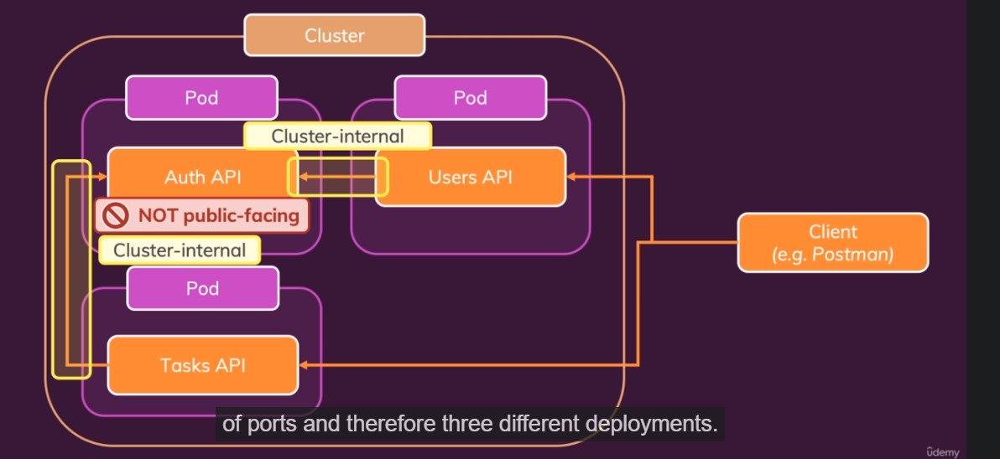
  + Bây giờ giao tiếp giữa pod với pod trong 1 cụm cluster
- Tạo file auth-deployment
    + 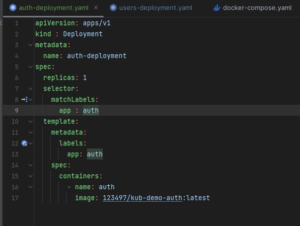
- tạo file auth-service.yaml*(chú ý chỗ config type là ClusterIP trong file COnfig này )*
    + 
- Apply auth-deployment và auth-services:
    + `kubectl apply -f=kubernetes/auth-service.yaml -f=kubernetes-auth-deployment.yaml`
- Sửa đường dẫn đến authAPI trong file users-app.js như sau:
    + 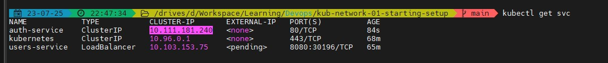
    + 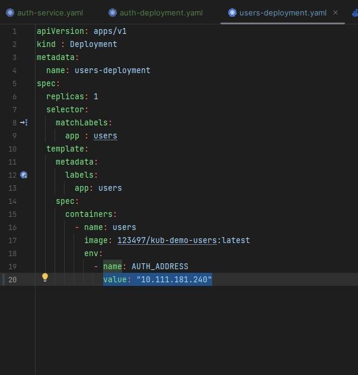
    + Giải thích dùng giá trị _AUTH_SERVICE_SERVICE_HOST_ : Giá trị này là "tên của authserrivce" + "SERVICE_HOST"
    + GIá trị trên sẽ tự động gen IP address bởi K8S
- Build lại images user-apis:
    + cd tới folder users-api
    + Build lại image : `docker build -t 123497/kub-demo-users .`
    + Pussh leen docker hub : `docker push 123497/kub-demo-users`
- Xóa users-deployment rồi apply lại : 
    + `kubectl delete -f=kubernetes/users-deployment.yaml`
    + `kubectl apply -f=kubernets/users-deployment.yaml`
- =>> Tổng kết cho phần 4.5 này: 
    + Call api signup và login được là đúng
    + Giá trị "AUTH_SERVICE_SERVICE_HOST" sẽ tự động gen IP address của auth_service (k8s gen)
